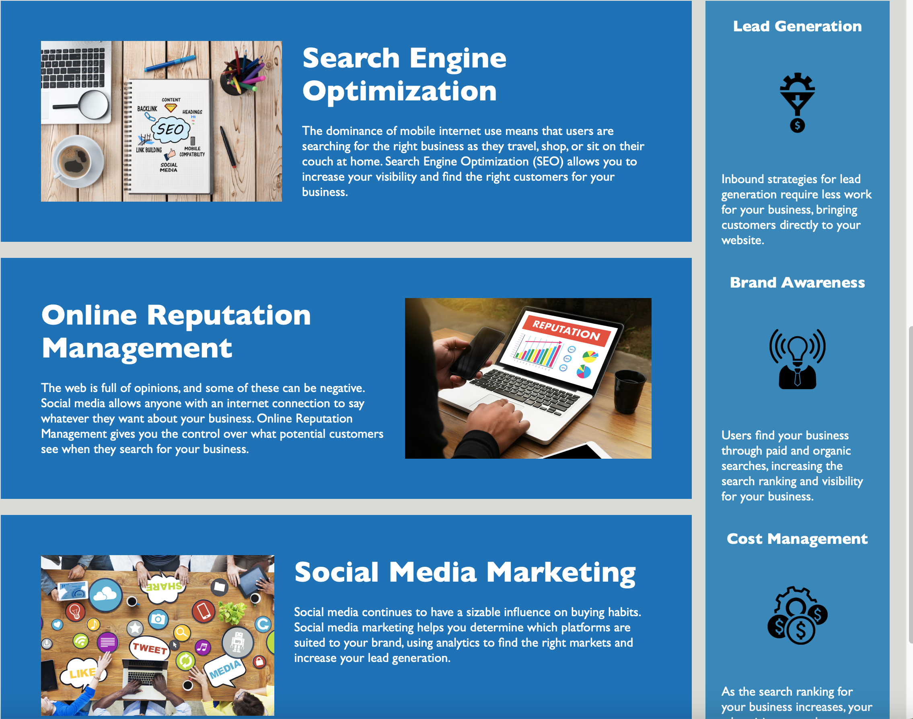

# challenge-01-code-refactor

## Description

This project contains the Bootcamp Week 1 Challenge that consists of HTML and CSS refactoring, and Github usage. My motivation for this project is to work on my web design skills and usage of github. I built this project to become more proficient in using semantic HTML elements as well as using github as a repository for my work. This project aimed to create an HTML file that follows accessibility standards. I learned that there are various semantic HTML elements that help the flow of the document. I also learned that while it is important to include alt text with images, it is important to include descriptive text when using icons for accessibility purposes. Finally, I am learning that I am feeling more comfortable using github and repositories for my projects.

## Installation

To view my project click the link below:

https://kittykatt210.github.io/challenge-01-code-refactor/#social-media-marketing

## Usage

This project is intended to be used to verify that the page meets accessibilty standards. You can use a screen reader or other accessibility applications to verify that the site has been optimized for accessibility usage.

The following images show the web application's appearance:

## Credits

The source code for this project comes from the UTSA Full Stack Web Developement Bootcamp and was authored by Will Utterback.

The following site was used to learn about HTML semantic elements:

https://www.w3schools.com/html/html5_semantic_elements.asp

The following site was used to learn about how to create links to sections within the same HTML page:

https://www.geeksforgeeks.org/how-to-create-links-to-sections-within-the-same-page-in-html/

The following site was used to learn how to create a professional README file:

https://coding-boot-camp.github.io/full-stack/github/professional-readme-guide
